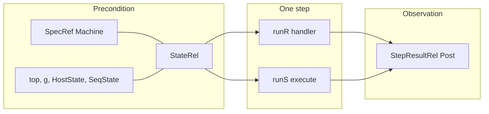
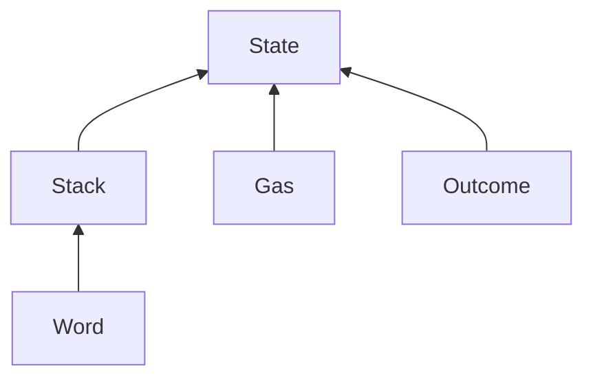

# Relations

The **bridge predicates**: what it means for a SpecRef state (or step outcome)
to correspond to an extraction state (or step outcome).

This directory answers *when are the two sides related?*  
[`../Representation/`](../Representation/) answers *how do their executables
actually run, so we can prove the relation is preserved?*

```text
Representation/     facts about ONE side's definitions
                    runR / runS, pop/push characterizations, word BitVec↔Nat, …

Relations/          predicates BETWEEN the two sides
                    WordRel, StackRel, GasRel, StateRel, StepResultRel, …
```

Opcode theorems have the shape:

```lean
StateRel sRef top g hs ss
  →  StepResultRel Post (runR (handler …) sRef) (runS (execute …) hs ss)
```

[`StateRel`](State.lean#L36) is the precondition;
[`StepResultRel`](Outcome.lean#L53) is the observation. Success-only theorems
are not acceptable — see [`Outcome.lean`](Outcome.lean).



---

## Representation vs Relations

| | [`Representation/`](../Representation/) | **`Relations/` (this dir)** |
| --- | --- | --- |
| Kind | Equalities / run lemmas about *one* model | `Prop` relating *both* models |
| Typical name | [`runS_pop`](../Representation/EvmStack.lean#L212), [`word_and_eq`](../Representation/BitwiseWord.lean#L20) | [`StackRel`](Stack.lean#L24), [`StepResultRel`](Outcome.lean#L53) |
| Mentions both sides? | Only when collapsing equivalent ops | Always (by definition) |
| Grows when… | A new host primitive or word encoding appears | A new observable component enters the slice |
| Trust / methodology | Proof engineering | Comparison boundary — recorded in [`docs/comparison-matrix.md`](../../docs/comparison-matrix.md) |

**Do not** put simulation theorems here (those are [`Opcodes/`](../Opcodes/)).  
**Do not** silently weaken a relation to make a proof go through — ledger
disagreement in [`docs/mismatches.md`](../../docs/mismatches.md) /
[`Assumptions.lean`](../Assumptions.lean) first ([`AGENTS.md`](../../AGENTS.md)).

---

## File map

Dependency order (bottom → top):

```text
Word ──► Stack ──┐
         Gas  ───┼──► State
         Outcome ┘
```



---

### [`Word.lean`](Word.lean) — word well-formedness and equality

Both sides use `Nat` for EVM words (SpecRef `U256`, extraction `word`). The
relation is equality; the file exists so every use-site names the abstraction
and so the **type-level missing bound** has one home:

| Def | Meaning |
| --- | --- |
| [`WordWf`](Word.lean#L20) `x` | `x < 2^256` |
| [`WordRel`](Word.lean#L23) `x w` | `x = w` |

[`WordWf`](Word.lean#L20) is carried on every stack entry by
[`StackRel`](Stack.lean#L24) and used by
[`Representation/SignedWord`](../Representation/SignedWord.lean) /
[`BitwiseWord`](../Representation/BitwiseWord.lean). Neither upstream states it
in types; handlers re-establish it by wrapping / `u256`.

---

### [`Stack.lean`](Stack.lean) — operand-stack correspondence

Packages the raw hypotheses from
[`Representation/EvmStack`](../Representation/EvmStack.lean) into one structure.

```text
SpecRef:  head = top          S = [a, b, c]
Evm:      bottom-indexed list + StackTop cursor
          prefix-up-to-cursor = S.reverse
```

```lean
structure StackRel (S : List Nat) (hs : HostState) (top : StackTop) : Prop where
  frame  : ∃ l rest, hs.stackFrames = l :: rest ∧
             l.take top.toNat = S.reverse ∧ top.toNat ≤ l.length
  height : top.toNat = S.length
  limit  : S.length ≤ 1024
  wf     : ∀ x ∈ S, WordWf x
```

Source: [`StackRel`](Stack.lean#L24).

[`cursor_headroom`](Stack.lean#L39) turns `S.length < 1024` into the
`BitVec 64` no-wrap fact `push_word` needs.

---

### [`Gas.lean`](Gas.lean) — two-dimensional gas correspondence

Amsterdam gas is three quantities on SpecRef (`gasLeft`, `stateGasLeft`,
`stateGasSpilled`). The extraction **state-passes** live execution gas as the
`g` argument of `execute` (the `gas_remaining` register is authoritative only
at frame boundaries) and keeps reservoir/spill in registers.

```lean
structure GasRel (evmRef : SpecRef.Evm) (g : Nat) (ss : SeqState) : Prop where
  live      : g = evmRef.gasLeft
  reservoir : ss.regs.get? state_gas_remaining = some evmRef.stateGasLeft
  spilled   : ss.regs.get? state_gas_spilled   = some evmRef.stateGasSpilled
```

Source: [`GasRel`](Gas.lean#L21). [`SeqState`](../Representation/EvmMonad.lean#L25)
is defined in Representation.

---

### [`Outcome.lean`](Outcome.lean) — observation boundary for one step

How failure is *represented* differs:

| Side | Success | Exceptional halt |
| --- | --- | --- |
| SpecRef [`runR`](../Representation/SpecRefLemmas.lean#L24) | `.ok (.ok (), s')` | `.ok (.error e, s')` — machine still returned |
| `Evm` [`runS`](../Representation/EvmMonad.lean#L32) `execute` | `.ok ((pc',top',mem',g'), hs') ss'` | same `.ok` shape, but `g' = 0` and `frame_status = Exceptional k` |

Outer SpecRef `.error` (`SpecError`) is a **spec abort**, not an EVM outcome —
step theorems exclude it.

```lean
inductive StepResultRel (Post : …) : SpecStepResult → EvmStepResult → Prop
  | success (hpost : Post sR' step hs' ss') …
  | halted  (herr : ErrorRel e k)
            (hstatus : frame_status = Exceptional k) …
            -- requires g' = 0 in the returned tuple; no full Post
```

Sources: [`StepResultRel`](Outcome.lean#L53), [`ErrorRel`](Outcome.lean#L35),
[`EvmStep`](Outcome.lean#L42) / [`EvmStepResult`](Outcome.lean#L45) /
[`SpecStepResult`](Outcome.lean#L49).

[`ErrorRel`](Outcome.lean#L35) currently covers stack underflow/overflow and
out-of-gas; extend as new halt kinds enter scope.

On the **halted** branch, stack/pc/memory are not related (mismatch
[**MM-1**](../../docs/mismatches.md#mm-1-operation-order-in-alu-handlers-pop-then-charge-vs-validate-charge-then-pop):
sides differ past the frame boundary; teardown discards them). Only kind +
zeroed gas are required.

---

### [`State.lean`](State.lean) — ALU-slice [`StateRel`](State.lean#L36)

The minimal precondition for arithmetic / stack opcodes. Grows monotonically
as more machinery enters scope (rows already tracked in
[`docs/comparison-matrix.md`](../../docs/comparison-matrix.md)).

```lean
structure StateRel (sRef : Machine) (top : StackTop) (g : Nat)
    (hs : HostState) (ss : SeqState) : Prop where
  stack      : StackRel sRef.evm.stack hs top
  gas        : GasRel sRef.evm g ss
  runningRef : sRef.evm.running = true ∧ sRef.evm.error = none
  runningEvm : frame_status = Running
  profile    : ∃ prof, … ∧ AmsterdamProfile prof   -- for exc_halt
  message    : ∃ msg,  regs.message = some msg     -- for refill
```

Source: [`StateRel`](State.lean#L36). Profile gate:
[`AmsterdamProfile`](State.lean#L31).

**PC convention ([MM-4](../../docs/mismatches.md#mm-4-step-boundary-pc-convention)).**
Extraction advances `pc` in `fetch` *before* `execute`; SpecRef handlers
advance it themselves. ALU-slice theorems take `pc_in = sRef.evm.pc + 1` and
conclude the returned pc equals the SpecRef post-state pc — they agree at
**step boundaries**, not at the `execute` entry.

[`AmsterdamProfile`](State.lean#L31) is threaded, never eliminated (fixed-fork
comparison).

---

## What is *not* in [`StateRel`](State.lean#L36) (yet)

Intentionally out of the ALU slice — add when the matrix row moves in scope:

- Memory / `EvmMemorySlice` contents  
- Full account / storage / host world  
- Code / jumpdest map  
- Call stack beyond the active frame  
- pc as a related *pre*-state field (see [MM-4](../../docs/mismatches.md#mm-4-step-boundary-pc-convention))

Absence from [`StateRel`](State.lean#L36) is not absence from the comparison —
check [`docs/comparison-matrix.md`](../../docs/comparison-matrix.md).

---

## How an opcode uses this

```text
hrel : StateRel sRef top g hs ss
        │
        ├─► open StackRel / GasRel / register ∃s
        ├─► rewrite with Representation run lemmas
        └─► assemble StepResultRel
              · success → rebuild StateRel-like Post (stack/gas/status/…)
              · halted  → ErrorRel + frame_status + gas 0
```

Generic binop harvesting ([`Opcodes/BinopFamily.lean`](../Opcodes/BinopFamily.lean))
is parameterized over [`StateRel`](State.lean#L36) /
[`StepResultRel`](Outcome.lean#L53); do not invent a weaker local relation
inside an opcode file.
