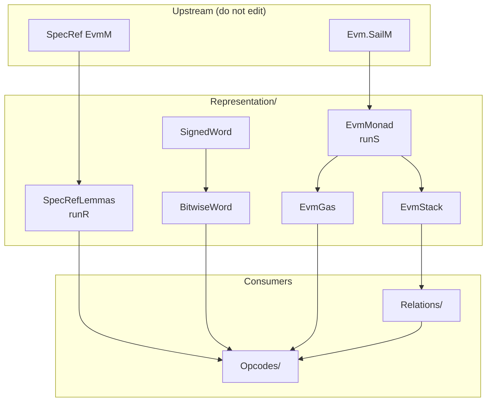

# Representation

**How each side's definitions actually execute** — run shapes and
characterizations that make SpecRef ↔ `Evm` simulation rewritable.

| This directory | Sibling |
| --- | --- |
| Facts about **one** model ([`runR`](SpecRefLemmas.lean#L24), [`runS`](EvmMonad.lean#L32), [`word_and_eq`](BitwiseWord.lean#L20), …) | [`../Relations/`](../Relations/) — predicates **between** models ([`StateRel`](../Relations/State.lean#L36), [`StepResultRel`](../Relations/Outcome.lean#L53), …) |

Package map: [`../README.md`](../README.md).

Upstream (SpecRef / lean-sail extraction) mostly ships bare definitions.
Without this layer, every opcode proof re-derives `StateT`/`EStateM`/`ExceptT`
binds and BitVec↔Nat round-trips from scratch.

```text
  SpecRef (EvmAsm)          extraction (Evm)           this package
  ─────────────────         ────────────────           ────────────
  EvmM / Machine            SailM / HostState+regs
        │                         │
        ▼                         ▼
   SpecRefLemmas               EvmMonad ──► EvmGas
        │                         │           EvmStack
        │                         │
        └──── SignedWord / BitwiseWord ────┘
                      │
                      ▼
              Relations/ + Opcodes/
```



## Design rules

| Rule | Why |
| --- | --- |
| One normal form per side: [`runR`](SpecRefLemmas.lean#L24) / [`runS`](EvmMonad.lean#L32) | Opcode proofs never open `ExceptT.run` or `StateT.run` by hand |
| Register reads need `ss.regs.get? r = some v` | No global “all regs initialized” axiom; [`StateRel`](../Relations/State.lean#L36) supplies the hyps |
| Word facts require [`WordWf`](../Relations/Word.lean#L20) (`< 2^256`) | Neither side enforces the bound in types |
| Prefer `@[simp]` on pure run laws; keep fused `*_bind_ok` for chains | Avoid sticky `match` residue in long rewrites |

**Not here:** outcome mapping ([`ErrorRel`](../Relations/Outcome.lean#L35) /
[`StepResultRel`](../Relations/Outcome.lean#L53)), packaged state relations, or
opcode-specific simulation theorems.

---

## File map

### [`EvmMonad.lean`](EvmMonad.lean) — `Evm.SailM` run algebra

**Motivation.**  
`Evm.SailM α = StateT HostState (Evm.Defs.SailM) α`, and the base is an
`EStateM` over the register file. Neither lean-sail nor the extraction gives
usable run lemmas.

**What it provides.**

| Concept | Meaning |
| --- | --- |
| [`SeqState`](EvmMonad.lean#L25) | lean-sail sequential register state |
| [`SailError`](EvmMonad.lean#L29) | `Sail.Error Evm.Defs.exception` |
| [`runS`](EvmMonad.lean#L32) `m hs ss` | Fully applied run → `EStateM.Result … (α × HostState)` |

Primitives: [`runS_pure`](EvmMonad.lean#L37) / [`runS_bind`](EvmMonad.lean#L41) /
[`runS_bind_ok`](EvmMonad.lean#L54), [`runS_lift`](EvmMonad.lean#L63),
[`runS_readReg`](EvmMonad.lean#L76) / [`runS_writeReg`](EvmMonad.lean#L84),
host [`get`](EvmMonad.lean#L92)/[`set`](EvmMonad.lean#L96)/[`modify`](EvmMonad.lean#L100),
[`throw`](EvmMonad.lean#L106).

Everything monadic on the extraction side goes through [`runS`](EvmMonad.lean#L32).

```text
runS : SailM α → HostState → SeqState → Result SailError SeqState (α × HostState)
         │            │           │
         action     outer       register file
                    StateT
```

---

### [`SpecRefLemmas.lean`](SpecRefLemmas.lean) — SpecRef `EvmM` run algebra

**Motivation.**  
Mirror of [`EvmMonad`](EvmMonad.lean) for SpecRef. SpecRef primitives are often
definitional (`rfl`), but proofs still need one normal form and case-split
lemmas for stack/gas.

**Monad shape.**

```text
EvmM α = ExceptT EvmError (StateT Machine (Except SpecError)) α

runR m s : Except SpecError (Except EvmError α × Machine)
             │                  │
             spec abort         EVM exceptional halt
             (excluded)         (carries mutated Machine)
```

Source: [`runR`](SpecRefLemmas.lean#L24). The inner `.error` still returns a
`Machine` — required for halt-boundary comparison (see
[`Relations/Outcome`](../Relations/Outcome.lean)).

**What it provides.** [`runR_pure`](SpecRefLemmas.lean#L29) /
[`runR_throw`](SpecRefLemmas.lean#L33) / [`runR_bind`](SpecRefLemmas.lean#L37) /
[`runR_bind_ok`](SpecRefLemmas.lean#L51) / [`runR_bind_err`](SpecRefLemmas.lean#L58),
[`getEvm`](SpecRefLemmas.lean#L65)/[`modifyEvm`](SpecRefLemmas.lean#L69),
[`stackPop`](SpecRefLemmas.lean#L74)/[`stackPush`](SpecRefLemmas.lean#L85)
(ok + underflow/overflow), [`charge_gas`](SpecRefLemmas.lean#L100) (ok + OOG).

---

### [`EvmGas.lean`](EvmGas.lean) — charge, refill, exceptional halt, stack guard

**Depends on:** [`EvmMonad`](EvmMonad.lean).

**Motivation.**  
Extraction gas is not a pure counter: failed `charge` runs `exc_halt`, which
refills frame state-gas (Amsterdam-gated), zeroes returned gas, and sets
`frame_status := Exceptional k`. `validate_stack` is the YP guard in front of
every instruction.

**What it provides.**

| Def / theorem | Role |
| --- | --- |
| [`haltRegs`](EvmGas.lean#L29) / [`refillRegs`](EvmGas.lean#L36) | Explicit post-register files after halt / refill |
| [`runS_charge_ok`](EvmGas.lean#L48) / [`runS_charge_oog`](EvmGas.lean#L92) | Success vs OOG paths |
| [`runS_refill`](EvmGas.lean#L55) / [`runS_exc_halt`](EvmGas.lean#L76) | Amsterdam profile + register hyps |
| [`runS_validate_stack_ok`](EvmGas.lean#L110) / [`_*_underflow`](EvmGas.lean#L123) / [`_*_overflow`](EvmGas.lean#L142) | Stack guard |

Profile / spill / message registers appear as hypotheses — same convention as
[`runS_readReg`](EvmMonad.lean#L76).

```text
charge amount ≤ gas  ──►  (true, gas − amount)     state untouched
charge amount > gas  ──►  (false, GAS_ZERO)        haltRegs (OutOfGas)
validate_stack fail  ──►  same halt shape          StackUnder/Overflow
```

---

### [`EvmStack.lean`](EvmStack.lean) — host operand stack ↔ abstract list

**Depends on:** [`EvmMonad`](EvmMonad.lean).

**Motivation.**  
The extraction stack is a **bottom-indexed** `List word` in
`HostState.stackFrames.head`, addressed by a wrapping `StackTop : BitVec 64`.
`pop` only retreats the cursor; the old slot stays as inaccessible scratch
until a later `push` overwrites it.

SpecRef uses a head-is-top `List U256`. Faithful abstraction is
**prefix-up-to-cursor**:

```text
(currentStack hs).take top.toNat  =  S.reverse
top.toNat                         =  S.length
```

**What it provides.**

- Characterizations of private host helpers (`currentStack`, `replaceListAt`, …)
- Cursor arithmetic under bounds (`< 2^64`, supplied by the 1024 limit)
- [`runS_peek`](EvmStack.lean#L200) / [`runS_pop`](EvmStack.lean#L212) /
  [`runS_push_word`](EvmStack.lean#L228) /
  [`runS_stack_height`](EvmStack.lean#L187) under the raw `hframe` / `hpfx` /
  `htop` hypotheses

[`Relations/Stack.lean`](../Relations/Stack.lean) packages those hyps into
[`StackRel`](../Relations/Stack.lean#L24).

```text
SpecRef S = [a, b, c]     (a = top)
                 │
                 ▼ reverse + take
Evm list l     = [c, b, a, …scratch…]
cursor top     = 3
```

---

### [`SignedWord.lean`](SignedWord.lean) — two's-complement bridge

**Depends on:** [`Relations/Word`](../Relations/Word.lean)
([`WordWf`](../Relations/Word.lean#L20)).

**Motivation.**  
Extraction reads signed structure via BitVec (`word_bit`, `word_abs`,
`word_negate`). SpecRef uses `toSigned` / `fromSigned` on `Int`. Proved once
for SDIV, SMOD, SLT, SGT, SIGNEXTEND, SAR.

**Notable detail.** `omega` does not normalize `Int` powers, so
[`fromSigned_eq`](SignedWord.lean#L27) / [`toSigned_eq`](SignedWord.lean#L32)
expose `2^256` as an `Int` numeral; downstream goals stay `omega`-friendly.

**Core correspondences.**

| Extraction | SpecRef |
| --- | --- |
| [`word_bit_255_iff`](SignedWord.lean#L53) | `2^255 ≤ a` (when `WordWf a`) |
| [`word_negate_eq`](SignedWord.lean#L73) | `fromSigned (-(q : Int))` |
| [`word_abs_eq`](SignedWord.lean#L118) | `(toSigned a).natAbs` |

Also: [`get_slice_int_256`](SignedWord.lean#L40) (shared with BitwiseWord).

---

### [`BitwiseWord.lean`](BitwiseWord.lean) — bitwise / shift bridge

**Depends on:** [`SignedWord`](SignedWord.lean) (for
[`get_slice_int_256`](SignedWord.lean#L40)).

**Motivation.**  
Extraction bitwise/shift ops round-trip through `BitVec 256`; SpecRef uses
`Nat` ops (`&&&`, `<<<`, …). Collapse the round trips under
[`WordWf`](../Relations/Word.lean#L20).

**What it provides.**

- [`word_and_eq`](BitwiseWord.lean#L20) (and `or`/`xor`/`not`/`shift_*` /
  `word_low_byte_eq` in the same file)
- Field arithmetic for SAR / SIGNEXTEND: [`or_high_low`](BitwiseWord.lean#L89)
  and related (`(q * 2^w) ||| b = q * 2^w + b` when `b < 2^w`)

---

## Dependency order

```text
EvmMonad ─────────────────────────────┐
   │                                  │
   ├─► EvmGas                         │
   └─► EvmStack                       │
                                      │
SpecRefLemmas (independent of Evm*)   │
                                      │
WordWf (Relations/Word) ─► SignedWord ─► BitwiseWord
                                      │
                                      ▼
                         Relations/*  +  Opcodes/*
```

Build / mental order when extending: **monad → gas/stack → words → relations → opcode**.

---

## How an opcode proof uses this

Typical ALU step (schematic):

1. **[`runR`](SpecRefLemmas.lean#L24)** peel SpecRef `binOp` / `charge_gas` /
   stack ops ([`SpecRefLemmas`](SpecRefLemmas.lean)).
2. **[`runS`](EvmMonad.lean#L32)** peel `validate_stack` → `charge` →
   `pop`/`push` → ALU ([`EvmMonad`](EvmMonad.lean) + [`EvmGas`](EvmGas.lean) +
   [`EvmStack`](EvmStack.lean)).
3. Pure ALU: either a binop lemma (`wrap256`, …) or
   [`BitwiseWord`](BitwiseWord.lean) / [`SignedWord`](SignedWord.lean) for the
   word op.
4. Close with [`StepResultRel`](../Relations/Outcome.lean#L53)
   ([`Relations/Outcome`](../Relations/Outcome.lean)).

Family harvesting ([`Opcodes/BinopFamily.lean`](../Opcodes/BinopFamily.lean))
assumes this layer is already stable — do not fork parallel run lemmas inside
opcode files.
