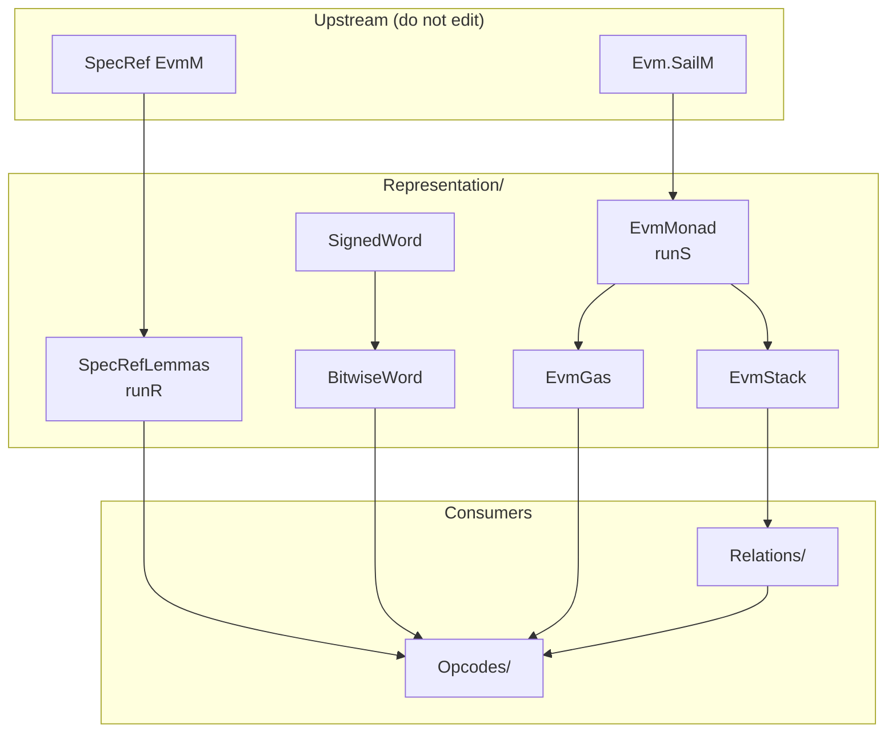

# Representation

**How each side's definitions actually execute** — run shapes and
characterizations that make SpecRef ↔ `Evm` simulation rewritable.

| This directory | Sibling |
| --- | --- |
| Facts about **one** model (`runR`, `runS`, `word_and_eq`, …) | [`../Relations/`](../Relations/) — predicates **between** models (`StateRel`, `StepResultRel`, …) |

Package map: [`../README.md`](../README.md).

Upstream (SpecRef / lean-sail extraction) mostly ships bare definitions.
Without this layer, every opcode proof re-derives `StateT`/`EStateM`/`ExceptT`
binds and BitVec↔Nat round-trips from scratch.

```text
  SpecRef (EvmAsm)          extraction (Evm)           this package
  ─────────────────         ────────────────           ────────────
  EvmM / Machine            SailM / HostState+regs
        │                         │
        ▼                         ▼
   SpecRefLemmas               EvmMonad ──► EvmGas
        │                         │           EvmStack
        │                         │
        └──── SignedWord / BitwiseWord ────┘
                      │
                      ▼
              Relations/ + Opcodes/
```



## Design rules

| Rule | Why |
| --- | --- |
| One normal form per side: `runR` / `runS` | Opcode proofs never open `ExceptT.run` or `StateT.run` by hand |
| Register reads need `ss.regs.get? r = some v` | No global “all regs initialized” axiom; `StateRel` supplies the hyps |
| Word facts require `WordWf` (`< 2^256`) | Neither side enforces the bound in types |
| Prefer `@[simp]` on pure run laws; keep fused `*_bind_ok` for chains | Avoid sticky `match` residue in long rewrites |

**Not here:** outcome mapping (`ErrorRel` / `StepResultRel`), packaged state
relations, or opcode-specific simulation theorems.

---

## File map

### `EvmMonad.lean` — `Evm.SailM` run algebra

**Motivation.**  
`Evm.SailM α = StateT HostState (Evm.Defs.SailM) α`, and the base is an
`EStateM` over the register file. Neither lean-sail nor the extraction gives
usable run lemmas.

**What it provides.**

| Concept | Meaning |
| --- | --- |
| `SeqState` | lean-sail sequential register state |
| `SailError` | `Sail.Error Evm.Defs.exception` |
| `runS m hs ss` | Fully applied run → `EStateM.Result … (α × HostState)` |

Primitives: `pure` / `bind` / `bind_ok`, `StateT.lift`, `readReg` / `writeReg`,
host `get`/`set`/`modify`, `throw`.

Everything monadic on the extraction side goes through `runS`.

```text
runS : SailM α → HostState → SeqState → Result SailError SeqState (α × HostState)
         │            │           │
         action     outer       register file
                    StateT
```

---

### `SpecRefLemmas.lean` — SpecRef `EvmM` run algebra

**Motivation.**  
Mirror of `EvmMonad` for SpecRef. SpecRef primitives are often definitional
(`rfl`), but proofs still need one normal form and case-split lemmas for
stack/gas.

**Monad shape.**

```text
EvmM α = ExceptT EvmError (StateT Machine (Except SpecError)) α

runR m s : Except SpecError (Except EvmError α × Machine)
             │                  │
             spec abort         EVM exceptional halt
             (excluded)         (carries mutated Machine)
```

The inner `.error` still returns a `Machine` — required for halt-boundary
comparison (see `Relations/Outcome.lean`).

**What it provides.** `runR_*` for `pure`/`throw`/`bind`/`bind_ok`/`bind_err`,
`getEvm`/`modifyEvm`, `stackPop`/`stackPush` (ok + underflow/overflow),
`charge_gas` (ok + OOG).

---

### `EvmGas.lean` — charge, refill, exceptional halt, stack guard

**Depends on:** `EvmMonad`.

**Motivation.**  
Extraction gas is not a pure counter: failed `charge` runs `exc_halt`, which
refills frame state-gas (Amsterdam-gated), zeroes returned gas, and sets
`frame_status := Exceptional k`. `validate_stack` is the YP guard in front of
every instruction.

**What it provides.**

| Def / theorem | Role |
| --- | --- |
| `haltRegs` / `refillRegs` | Explicit post-register files after halt / refill |
| `runS_charge_ok` / `runS_charge_oog` | Success vs OOG paths |
| `runS_refill` / `runS_exc_halt` | Amsterdam profile + register hyps |
| `runS_validate_stack_ok` / `_*_underflow` / `_*_overflow` | Stack guard |

Profile / spill / message registers appear as hypotheses — same convention as
`runS_readReg`.

```text
charge amount ≤ gas  ──►  (true, gas − amount)     state untouched
charge amount > gas  ──►  (false, GAS_ZERO)        haltRegs (OutOfGas)
validate_stack fail  ──►  same halt shape          StackUnder/Overflow
```

---

### `EvmStack.lean` — host operand stack ↔ abstract list

**Depends on:** `EvmMonad`.

**Motivation.**  
The extraction stack is a **bottom-indexed** `List word` in
`HostState.stackFrames.head`, addressed by a wrapping `StackTop : BitVec 64`.
`pop` only retreats the cursor; the old slot stays as inaccessible scratch
until a later `push` overwrites it.

SpecRef uses a head-is-top `List U256`. Faithful abstraction is
**prefix-up-to-cursor**:

```text
(currentStack hs).take top.toNat  =  S.reverse
top.toNat                         =  S.length
```

**What it provides.**

- Characterizations of private host helpers (`currentStack`, `replaceListAt`, …)
- Cursor arithmetic under bounds (`< 2^64`, supplied by the 1024 limit)
- `runS_peek` / `runS_pop` / `runS_push_word` / `runS_stack_height` under the
  raw `hframe` / `hpfx` / `htop` hypotheses

`Relations/Stack.lean` packages those hyps into `StackRel`.

```text
SpecRef S = [a, b, c]     (a = top)
                 │
                 ▼ reverse + take
Evm list l     = [c, b, a, …scratch…]
cursor top     = 3
```

---

### `SignedWord.lean` — two's-complement bridge

**Depends on:** `Relations/Word` (`WordWf`).

**Motivation.**  
Extraction reads signed structure via BitVec (`word_bit`, `word_abs`,
`word_negate`). SpecRef uses `toSigned` / `fromSigned` on `Int`. Proved once
for SDIV, SMOD, SLT, SGT, SIGNEXTEND, SAR.

**Notable detail.** `omega` does not normalize `Int` powers, so
`fromSigned_eq` / `toSigned_eq` expose `2^256` as an `Int` numeral; downstream
goals stay `omega`-friendly.

**Core correspondences.**

| Extraction | SpecRef |
| --- | --- |
| `word_bit a 255 = 1` | `2^255 ≤ a` (when `WordWf a`) |
| `word_negate q` | `fromSigned (-(q : Int))` |
| `word_abs a` | `(toSigned a).natAbs` |

---

### `BitwiseWord.lean` — bitwise / shift bridge

**Depends on:** `SignedWord` (for `get_slice_int_256`).

**Motivation.**  
Extraction bitwise/shift ops round-trip through `BitVec 256`; SpecRef uses
`Nat` ops (`&&&`, `<<<`, …). Collapse the round trips under `WordWf`.

**What it provides.**

- `word_and/or/xor/not_eq`, `word_shift_left/right_eq`, `word_low_byte_eq`
- Field arithmetic for SAR / SIGNEXTEND: `or_high_low` and related
  (`(q * 2^w) ||| b = q * 2^w + b` when `b < 2^w`)

---

## Dependency order

```text
EvmMonad ─────────────────────────────┐
   │                                  │
   ├─► EvmGas                         │
   └─► EvmStack                       │
                                      │
SpecRefLemmas (independent of Evm*)   │
                                      │
WordWf (Relations/Word) ─► SignedWord ─► BitwiseWord
                                      │
                                      ▼
                         Relations/*  +  Opcodes/*
```

Build / mental order when extending: **monad → gas/stack → words → relations → opcode**.

---

## How an opcode proof uses this

Typical ALU step (schematic):

1. **`runR`** peel SpecRef `binOp` / `charge_gas` / stack ops (`SpecRefLemmas`).
2. **`runS`** peel `validate_stack` → `charge` → `pop`/`push` → ALU
   (`EvmMonad` + `EvmGas` + `EvmStack`).
3. Pure ALU: either a binop lemma (`wrap256`, …) or
   `BitwiseWord` / `SignedWord` for the word op.
4. Close with `StepResultRel` (`Relations/Outcome`).

Family harvesting (`Opcodes/BinopFamily.lean`) assumes this layer is already
stable — do not fork parallel run lemmas inside opcode files.
